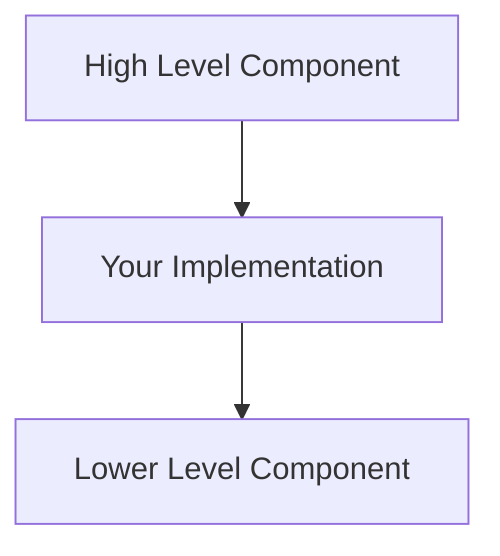

Systematically document a complex feature that required significant trial-and-error to implement, capturing both successful and failed approaches for future maintainers.

<UserContext>$ARGUMENTS</UserContext>

### Step 0: Gather information

Ask the user:
1. What feature was just implemented? (They may have already indicated this above)
2. Where should the documentation live? (Check existing docs structure first)
3. Are there any specific implementation details they want emphasized?

## Process

### Step 1: Review the Implementation History

Read through the conversation to identify:
- The initial goal/requirement
- All approaches that were tried (successful and failed)
- User corrections and feedback ("WTF dude", "no dude", etc.)
- The final working solution
- Critical insights that made the solution work

### Step 2: Create Architecture Documentation First

Before diving into details, document:
- **What** the implementation does (concise summary)
- **Why** standard approaches don't work (key challenges)
- **Where** in the stack it operates (create a Mermaid diagram showing layers)

Use visual diagrams for architecture:


### Step 3: Document Failed Approaches Section

Create a "Failed Approaches" section that captures learning. For each failed attempt:

**Structure:**
- **What we tried:** [Concrete description of the approach]
- **Why it failed:** [Specific technical reasons, with details]
- **What we learned:** [The insight that led to the next attempt]

**Why this matters:**
- Prevents future maintainers from trying the same failed approaches
- Shows the reasoning path that led to the solution
- Captures domain knowledge about constraints (timing, architecture, etc.)

**Example:**
```markdown
### Approach 3: Executing Tools After Message Iteration

**What we tried:** Collect all tool calls during message iteration, then execute them after `read_messages()` finishes yielding.

**Why it failed:** The SDK consumes ALL messages before checking state. By the time we could execute tools "after iteration", the SDK has already checked the flag and found it False.

**What we learned:** Tools MUST execute during message iteration, not after.
```

### Step 4: Document Critical Implementation Details

For each major technical challenge, document:
- **Problem:** What needed to be solved
- **Initial approach:** First attempt (may reference Failed Approaches)
- **Why it failed:** Technical reasons
- **Solution:** What actually worked, with code examples
- **Key insight:** The "aha moment" that made it work

Include code snippets showing:
- The problematic pattern (commented as "OLD" or "DON'T DO THIS")
- The correct pattern (commented as "NEW" or "DO THIS")
- Why the difference matters

### Step 5: Document Common Pitfalls

Create a section capturing mistakes that are easy to make:
- Things that seem like they should work but don't
- Subtle timing issues
- State management gotchas
- API misunderstandings

Format:
```markdown
### Pitfall: [Descriptive Name]

**Don't do this:**
```code showing the mistake```

**Why it's bad:** [Technical explanation]

**Do this instead:**
```code showing the correct approach```
```

### Step 6: Add Implementation Details Section

Use descriptive bullet points, not checkboxes:

```markdown
## Key Implementation Details

The [feature] implementation handles these aspects:

- **Aspect 1:** Description of what it does and why
- **Aspect 2:** Technical constraint and how it's addressed
- **Aspect 3:** Performance or correctness consideration
```

This reads as documentation of what IS implemented, not a checklist for implementors.

### Step 7: Document Verification (if applicable)

If the feature has measurable characteristics or verification mechanisms:
- How to verify it's working correctly
- What symptoms indicate it's broken
- Any relevant metrics or benchmarks

Example: For a caching/replay feature, include timing expectations:
- Recording: ~10-15 seconds (spawns subprocess, makes real API calls)
- Replay: ~0.5 seconds (no subprocess, yields from cache)
- If replay takes >2s, something is broken (likely spawning subprocess)

### Step 8: Update Related Documentation

Identify and update:
- **Development docs:** How developers run/test the feature
- **Code-base docs:** Reference the detailed guide from relevant sections
- **API/usage docs:** How users interact with the feature (if user-facing)

### Step 9: Verify Documentation Structure

Check that:
- Visual diagrams are used for architecture (not ASCII art)
- Section titles are descriptive, not generic ("Failed Approaches" not "Issues")
- The tone is present-tense descriptive ("The implementation handles..." not "You should...")
- Failed approaches are thoroughly documented with reasoning
- Code examples show both incorrect and correct patterns
- Performance expectations are concrete and measurable

### Step 10: Build and Verify

Run the documentation build to catch:
- Broken internal links
- Mermaid diagram syntax errors
- Formatting issues

Fix any issues before committing.

## Key Principles

**Capture the learning journey, not just the destination**
- Failed approaches are as valuable as the solution
- Document WHY things don't work, not just WHAT doesn't work
- Include enough detail that someone doesn't need to re-research any part of the stack (the runtime, the dependencies, or the application architecture itself) to understand the pitfalls involved when all these moving parts interact with each other

**Write for maintainers, not implementors**
- Document what IS, not what someone SHOULD DO
- Avoid framing as instructions for future reimplementation
- Keep that principle implicit in thoroughness, not explicit in tone

**Make it impossible to make the same mistakes**
- Document timing constraints with clear explanations of message flow
- Show state management gotchas with before/after code
- Include concrete examples of what fails and why

**Provide verification mechanisms**
- Include performance benchmarks ("should take ~0.5s")
- List symptoms of broken behavior
- Show how to debug when things go wrong

**Respect user corrections**
- When user swears at you for doing something wrong, that's a critical anti-pattern to document
- When user redirects approach, document why the old approach was wrong
- User feedback reveals what's non-obvious and needs explanation

**Structure for different audiences**
- Quick reference: Architecture diagram + Key Implementation Details
- Deep understanding: Failed Approaches + Critical Implementation Details
- Troubleshooting: Common Pitfalls + Performance Expectations
- Integration: Related documentation updates

## Example Documentation Flow

1. User just finished implementing VCR recording after many failed attempts
2. Review conversation: 6 failed approaches, multiple "WTF" corrections, timing issues
3. Create docs/docs/code-base/mekara/vcr-agent-recordings.md
4. Start with concise intro and architecture diagram showing layers
5. Add "Failed Approaches" with all 6 attempts and why each failed
6. Document critical issues (state management, timing, ID remapping)
7. Add common pitfalls (mutating dicts, wrong message detection)
8. Include performance expectations (0.5s vs 10s)
9. Update index.md, scripting.md, build-and-test.md with cross-references
10. Build docs, verify no broken links
11. Commit with comprehensive message

This creates documentation that future maintainers can use to understand not just HOW it works, but WHY it works that way.
