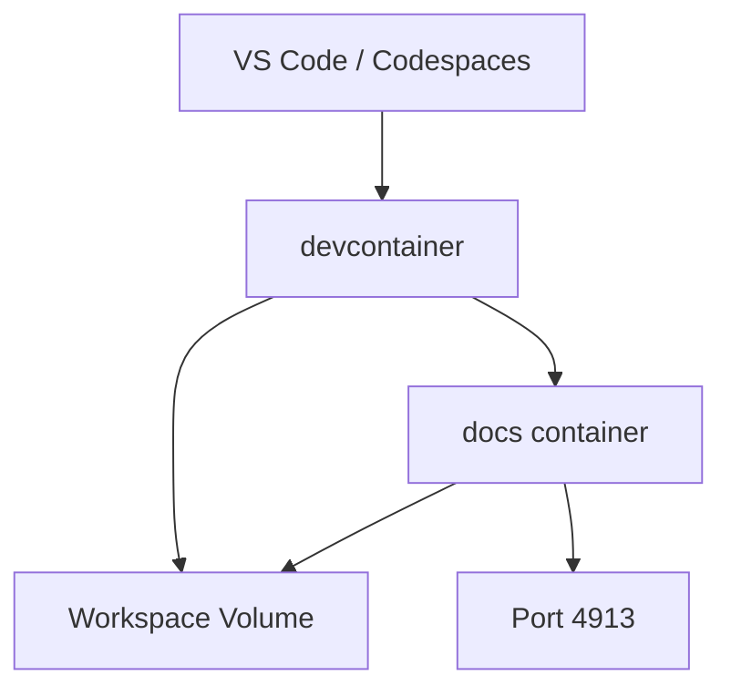

# Devcontainer

Implementation details for the VS Code Dev Container and GitHub Codespaces configuration.

## Architecture

The devcontainer uses Docker Compose to orchestrate two containers:

1. **devcontainer** - Python 3.12 environment for mekara CLI development
2. **docs** - Node.js environment running the Docusaurus dev server



The `devcontainer` service depends on `docs`, so the docs site starts automatically when the devcontainer launches.

## Key Files

- `.devcontainer/Dockerfile` - Devcontainer image (Python + Node.js + Poetry + Claude Code)
- `.devcontainer/devcontainer.json` - VS Code/Codespaces configuration
- `.devcontainer/docker-compose.yml` - Multi-container orchestration
- `docs/Dockerfile` - Docs container image (Node.js + pnpm + Docusaurus)
- `docs/.dockerignore` - Excludes node_modules and build artifacts from Docker context

## Implementation Details

### System Python (No Virtualenv)

The devcontainer disables Poetry's virtualenv creation:

```dockerfile
ENV POETRY_VIRTUALENVS_CREATE=false
```

This installs packages directly to system Python. Inside the container, run commands without `poetry run`:

```bash
# In devcontainer (no poetry run needed)
mekara mcp
pytest

# Outside container (virtualenv active)
poetry run mekara mcp
poetry run pytest
```

:::warning
This only applies inside the container. Local development still requires `poetry run` or `poetry shell`.
:::

### Installed Tools

The devcontainer includes the following tools:

| Tool     | Installation               | Purpose                           |
| -------- | -------------------------- | --------------------------------- |
| `python` | Base image (3.12)          | Runtime for mekara CLI            |
| `node`   | NodeSource APT repo (20.x) | Required by Claude Code CLI       |
| `poetry` | Official installer (2.2.1) | Python dependency management      |
| `pnpm`   | npm global                 | Docs commands inside devcontainer |
| `claude` | npm global                 | AI-assisted development           |
| `gh`     | GitHub APT repo            | PRs, issues, CI status            |

### postCreateCommand

The `postCreateCommand` in `devcontainer.json` that runs after the container is created should do the following things:

1. **poetry install --with dev** - Installs Python dependencies including dev tools
2. **pre-commit install** - Sets up git hooks for linting
3. **git config --global core.editor 'code --wait'** - Configures VS Code as the git editor (required for interactive git commands like `git commit` without `-m`)

:::note
The `--wait` flag is critical. Without it, VS Code returns immediately and git thinks you aborted the commit.
:::

### Docs Container Volume Strategy

The docs container mounts source files individually rather than the entire `docs/` directory:

```yaml
volumes:
  - ../docs/docs:/app/docs:cached
  - ../docs/src:/app/src:cached
  - ../docs/static:/app/static:cached
  - ../docs/docusaurus.config.ts:/app/docusaurus.config.ts:cached
  - ../docs/sidebars.ts:/app/sidebars.ts:cached
  - ../docs/tsconfig.json:/app/tsconfig.json:cached
```

This preserves the container's `node_modules` directory (installed during image build) while still enabling live reload for source files.

:::warning
If you mount the entire `docs/` directory, it would overwrite `node_modules` with an empty directory (since node_modules is in `.dockerignore`), breaking the docs site.
:::

### Poetry Cache Volume

A named volume persists Poetry's package cache across container rebuilds:

```yaml
volumes:
  - poetry-cache:/root/.cache/pypoetry
```

This speeds up `poetry install` on subsequent container creations.
