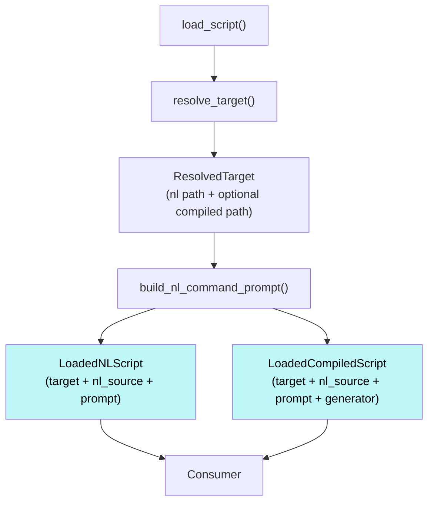

# Scripting Module

## Purpose

The scripting module provides everything needed to go from a script name to a ready-to-execute script object. This includes runtime primitives (`auto`, `llm`, `call_script`), name-to-path resolution, NL prompt construction, standards injection, and auto step execution.

## Scope

**In scope:**

- Runtime primitives (`auto`, `llm`, `call_script`) and their result types
- Script name resolution with precedence (local > user > bundled)
- Script loading: reading files, building prompts, returning fully-processed loaded script objects
- NL prompt construction: `$ARGUMENTS` substitution, standards injection
- Standards resolution and loading with `{{VERSION}}` substitution
- Auto step execution (shell commands, Python function calls)

**Out of scope:**

- Orchestrating script execution across multiple steps or managing execution frame stacks (the module loads scripts but does not run them)
- Deciding when or how auto steps and LLM steps are dispatched (the module defines and executes individual auto steps but does not sequence them)
- Compiling NL scripts into Python generators (the module consumes compiled scripts but does not produce them)

## Requirements

### Models runtime primitives

The module defines the step types (`Auto`, `Llm`, `CallScript`) and their corresponding result types that scripts are built from. These are the building blocks that compiled scripts yield to express their execution flow.

### Loads scripts into ready-to-use objects

The module takes a script name and returns a fully-processed object that consumers can use directly without additional loading or content processing. This is the module's main action, encompassing several sub-actions:

**Resolution:** The module resolves script names to file paths by searching:

- project (`.mekara/scripts/`)
- user (`~/.mekara/scripts/`)
- bundled (package `bundled/scripts/`)

in that order, taking the first match. At each precedence level, resolution tries the exact name first (e.g., `merge-main.md`), then the underscore variant (e.g., `merge_main.md`), allowing Python-style filenames for compiled scripts while preserving hyphenated names for NL scripts.

Name resolution details:

- Canonical script names use colons as path separators and preserve hyphens (e.g., `test:nested`, `merge-main`)
- Slashes in input are normalized to colons
- Underscore conversion is only for filesystem lookup, not canonical naming

**NL prompt construction:** The module reads raw NL content and processes it into a ready-to-use prompt through two transformations applied in order:

1. `$ARGUMENTS` substitution — only the first `$ARGUMENTS` occurrence is replaced with the actual request. Subsequent occurrences are preserved verbatim, allowing scripts to reference `$ARGUMENTS` in documentation without those references being substituted.
2. Standards injection — `@standard:name` references are resolved (using the same project > user > bundled precedence) and appended as a "Referenced Standards" section. Standard content has `<Version />` (Docusaurus component syntax) replaced with the actual mekara version.

**Constraints:**

- Every resolved script has an NL source. Compiled scripts are optional additions that override NL-only execution.
- A compiled script must exist at the same or higher precedence level as its NL source. A bundled compiled script cannot override a local NL script.
- All compiled scripts must define an `execute(request: str)` function that returns a generator.

### Provides auto step execution harness

The module provides the machinery for consumers to execute individual auto steps (shell commands and Python function calls). The module does not decide when to execute these steps — that decision belongs to the consumer.

## Architecture

### Runtime Primitives

Compiled scripts express their execution flow by yielding step objects. The module defines three step types and their corresponding results.

**`Auto`** — a deterministic automation step (shell command or Python function call):

| Field     | Type         | Description                                       |
| --------- | ------------ | ------------------------------------------------- |
| `action`  | `AutoAction` | The action to execute (shell command or callable) |
| `context` | `str`        | Context explaining WHY this step runs (verbatim)  |

`AutoAction` is either a `ShellAction` (with `cmd: str`) or a `CallAction` (with `func: Callable` and `kwargs: dict`). `Auto` also exposes a `description` property (human-readable: the command string for shell, `func_name(kwargs)` for call).

**`Llm`** — pauses execution for human/LLM interaction:

| Field     | Type             | Description                                   |
| --------- | ---------------- | --------------------------------------------- |
| `prompt`  | `str`            | Natural language instruction for the LLM      |
| `expects` | `dict[str, str]` | Expected outputs as `{key: description}` dict |

**`CallScript`** — invokes another script within the shared runtime:

| Field         | Type           | Description                         |
| ------------- | -------------- | ----------------------------------- |
| `name`        | `str`          | Name of the script to invoke        |
| `request`     | `str`          | Request text to pass to the script  |
| `working_dir` | `Path \| None` | Optional working directory override |

Scripts construct these via factory functions rather than directly:

- `auto(action, kwargs=None, *, context) -> Auto`
- `llm(prompt, expects=None) -> Llm`
- `call_script(name, request="", working_dir=None) -> CallScript`

Each step type has a corresponding result type that the consumer sends back into the generator:

| Result type        | Returned from     | Key fields                                      |
| ------------------ | ----------------- | ----------------------------------------------- |
| `ShellResult`      | Shell auto steps  | `success`, `exit_code`, `output`                |
| `CallResult`       | Python auto steps | `success`, `value`, `error`, `output`           |
| `AutoException`    | Failed auto steps | `success` (always false), `exception`, `output` |
| `LlmResult`        | LLM steps         | `success`, `outputs`                            |
| `ScriptCallResult` | Nested scripts    | `success`, `exception`                          |

`AutoResult` = `ShellResult | CallResult | AutoException`.

### Script Loading

A consumer loads a script by calling `load_script(name, request)` where `request` is the user-originated request. This is the unified entrypoint that orchestrates resolution, content reading, and prompt construction. It returns either a `LoadedNLScript` or a `LoadedCompiledScript`, both of which are fully processed and ready to use.

If the script cannot be found or loaded (missing NL source, missing `execute` function in compiled module, etc.), `load_script` raises `ScriptLoadError`.

The returned object carries a `target` field of type `ResolvedTarget`, which provides metadata about where the script was found:

**`ScriptInfo`** — information about a single script file:

| Field        | Type   | Description                           |
| ------------ | ------ | ------------------------------------- |
| `path`       | `Path` | Absolute path to the script file      |
| `is_bundled` | `bool` | Whether the script is package-bundled |

**`ResolvedTarget`** — the full resolution result:

| Field      | Type                 | Description                                      |
| ---------- | -------------------- | ------------------------------------------------ |
| `compiled` | `ScriptInfo \| None` | Compiled script info, or None if NL-only         |
| `nl`       | `ScriptInfo`         | NL source info (always present)                  |
| `name`     | `str`                | Canonical name with colons and hyphens preserved |

Derived properties: `target_type` (returns `Script.COMPILED` or `Script.NATURAL_LANGUAGE`), `is_bundled` (the `is_bundled` field of the effective `ScriptInfo`), `is_nl` (true if NL-only), `is_compiled` (true if compiled exists).

Consumers can also call `resolve_target(name)` directly to get a `ResolvedTarget` without loading content — this is pure path resolution with no file I/O on content.

The loaded script types share content fields but are distinct types (not subtypes of each other) — consumers must be able to distinguish them by type narrowing. Both carry:

| Field       | Type             | Description                                                    |
| ----------- | ---------------- | -------------------------------------------------------------- |
| `target`    | `ResolvedTarget` | Resolution result with file paths                              |
| `nl_source` | `str`            | Raw NL file content (before processing)                        |
| `prompt`    | `str`            | Processed content ($ARGUMENTS substituted, standards injected) |

`LoadedCompiledScript` adds one field:

| Field       | Type              | Description                                              |
| ----------- | ----------------- | -------------------------------------------------------- |
| `generator` | `ScriptGenerator` | The script's generator (from calling `execute(request)`) |

`LoadedScript` = `LoadedCompiledScript | LoadedNLScript`.

Internally, `load_script` performs these steps:



NL prompt construction is also available directly via `build_nl_command_prompt(command_content, request)` for consumers that already have raw content and need to process it independently of the loading pipeline.

### Standards

Standards are reusable documentation fragments that scripts reference via `@standard:name` syntax. The module provides two functions for working with them:

- `resolve_standard(name) -> Path | None` — resolve a standard name to its file path using the same project > user > bundled precedence as scripts
- `load_standard(name) -> str | None` — load a standard's content with `<Version />` substitution

`get_mekara_version()` reads the version from `pyproject.toml` (returns `"unknown"` if not found) and is used by `load_standard` for version substitution.

### Auto Step Execution

A consumer executes an individual auto step by passing it to an `AutoExecutor`:

`AutoExecutor.execute(step, *, working_dir) -> AsyncIterator[AutoExecutionResult]`

The executor is stateless — all context (including working directory) is passed per call. It yields a single `AutoExecutionResult` (a wrapper containing the step's `AutoResult`). The consumer decides when and whether to call this; the module just provides the execution harness.

On failure, the executor raises `AutoExecutionError`:

| Field                | Type        | Description                |
| -------------------- | ----------- | -------------------------- |
| `original_exception` | `Exception` | The original exception     |
| `output`             | `str`       | Captured output at failure |

## Implementation

### File Layout

```
src/mekara/scripting/
├── __init__.py       # Package exports (runtime primitives only)
├── runtime.py        # Step types (Auto, Llm, CallScript) and result types
├── resolution.py     # Name → path resolution with precedence
├── loading.py        # Script loading: resolution + content processing
├── auto.py           # Auto step execution (shell commands, Python calls)
├── nl.py             # NL prompt construction ($ARGUMENTS, standards)
└── standards.py      # Standards resolution and loading
```

### Design Choices

- `ResolvedTarget` and `ScriptInfo` are frozen dataclasses (immutable after construction)
- `SearchLevel` and `Match` are `NamedTuple`s (immutable value types for the resolution machinery)
- `ScriptGenerator` is typed as `Generator[Auto | Llm | CallScript, StepResult | None, Any]`
- Compiled modules are loaded via `importlib.util.spec_from_file_location`

### Internal Types

#### Resolution Types

**`SearchLevel`** — one directory to search with a given file extension:

| Field       | Type   | Description                          |
| ----------- | ------ | ------------------------------------ |
| `directory` | `Path` | Directory to search in               |
| `extension` | `str`  | File extension to match (e.g. `.md`) |

**`Match`** — a found file with its position in the search list:

| Field   | Type   | Description                                       |
| ------- | ------ | ------------------------------------------------- |
| `index` | `int`  | Index in the levels list where the file was found |
| `path`  | `Path` | Absolute path to the matched file                 |

#### Static Level Lists

At module load time, `resolution.py` builds `_LEVEL_DIRS` — a list of the base directory for each precedence level:

- Local: `project_root / ".mekara"` (omitted if not in a project)
- User: `Path.home() / ".mekara"`
- Bundled: `package / "bundled"`

All specific search level lists are derived from `_LEVEL_DIRS` by appending the relevant subpath:

- `_NL_SCRIPT_LEVELS` — `SearchLevel(d / "scripts" / "nl", ".md")` for each `d` in `_LEVEL_DIRS`
- `_COMPILED_SCRIPT_LEVELS` — `SearchLevel(d / "scripts" / "compiled", ".py")` for each `d`
- `_BUNDLED_BASE = _LEVEL_DIRS[-1]` — used to infer `is_bundled` when constructing `ScriptInfo` from a `Match`

`standards.py` imports `_LEVEL_DIRS` and derives its own list:

- `_STANDARDS_LEVELS` — `SearchLevel(d / "standards", ".md")` for each `d` in `_LEVEL_DIRS`

### Algorithms

#### Precedence Resolution

`resolve_target(name)`:

1. Find NL source: call `_find_highest_precedence(_NL_SCRIPT_LEVELS, filename)` where `filename = name` (tries both exact and underscore variant)
2. If no NL found, return `None`; record `nl_match.index`
3. Find compiled: call `_find_highest_precedence(_COMPILED_SCRIPT_LEVELS[:nl_match.index + 1], filename)` — the slice caps compiled search to the same or higher precedence as the NL source
4. Build canonical name: `name.replace("/", ":")`
5. Return `ResolvedTarget(compiled=compiled_info, nl=nl_info, name=canonical_name)`

#### `_find_highest_precedence(levels, filename) -> Match | None`

Shared helper that searches a list of `SearchLevel`s in order:

1. For each level at index `i`, try `level.directory / f"{filename}{level.extension}"` (exact)
2. Then try `level.directory / f"{filename.replace('-', '_')}{level.extension}"` (underscore variant)
3. Return `Match(index=i, path=matched_path)` for the first match found, or `None`

#### $ARGUMENTS Substitution

In `build_nl_command_prompt(command_content, request)`:

1. If `$ARGUMENTS` appears in content, replace only the first occurrence with the request string (using `str.replace(old, new, 1)`)
2. Subsequent `$ARGUMENTS` occurrences are preserved verbatim

#### Standards Injection

In `build_nl_command_prompt()`, after $ARGUMENTS substitution:

1. Find all `@standard:name` references via regex `r"@standard:(\w+)"`
2. Deduplicate while preserving order
3. Load each standard via `load_standard(name)`
4. If any standards were loaded, append a `## Referenced Standards` section with each standard under an `### @standard:name` heading

#### Standards Resolution

`resolve_standard(name)`:

1. Call `_find_highest_precedence(_STANDARDS_LEVELS, name)` — no cap, searches all levels
2. Return `match.path` if found, or `None`

#### Compiled Module Loading

`_load_compiled_module(script_file, script_name)`:

1. Load Python module from file path using `importlib.util`
2. Extract `execute` attribute from module
3. Raise `ScriptLoadError` if module spec is None, loader is None, or `execute` not found
4. Return the `execute` function

#### Auto Step Execution

`AutoExecutor.execute(step, working_dir)`:

For shell commands:

1. Create subprocess via async shell execution
2. Capture stdout and stderr
3. Return `ShellResult` with combined output and exit code

For Python calls:

1. Run function in a background thread
2. Change working directory for duration of call
3. Capture stdout/stderr
4. On exception, raise `AutoExecutionError` with captured output
5. Return `CallResult` with return value and captured output
