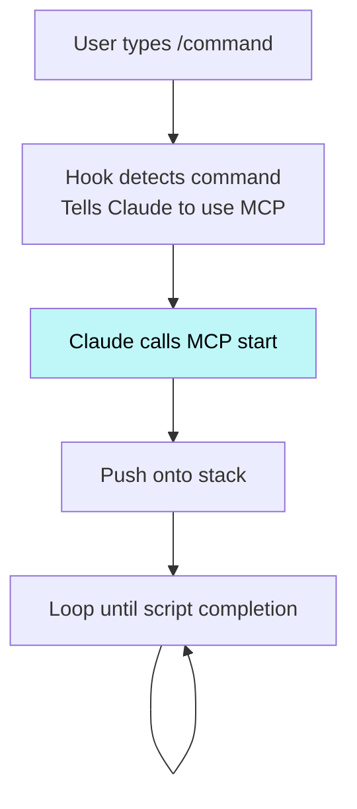
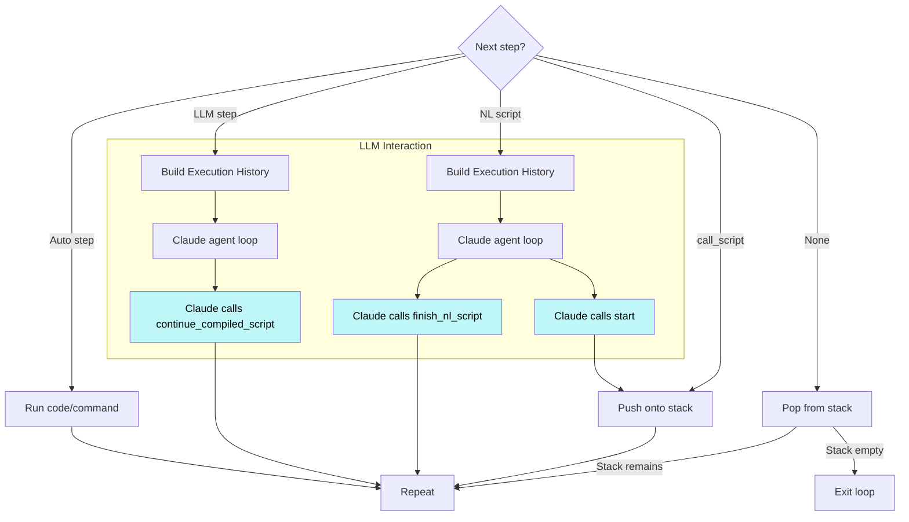

# Core

This page covers the foundational architecture of mekara.

## Mental Model

`mekara` is an MCP server that provides script execution capabilities for Claude Code. Scripts define a sequence of steps that alternate between deterministic automation (`auto` steps) and LLM-driven interaction (`llm` steps).

The basic interaction with the hook can be seen as such:



whereas each iteration of the loop looks like this:



The basic script execution algorithm can be summarized as:

- What's the next step in the script?
  - Auto step &rarr; Execute it automatically
  - LLM step &rarr; Prompt the LLM to execute the next single step, and call `continue_compiled_script` with outputs (use `{}` when none) when done
  - Invoke a script &rarr; Push to the stack, and check if it's a:
    - Compiled script &rarr; Recurse and execute each step according to this algorithm
    - Natural language script &rarr; Ask the LLM to complete the entire script, and call `finish_nl_script` when done
  - None &rarr; End the script and pop the stack

The LLM prompting algorithm can be summarized as:

1. Gather the entire history of executed auto steps since the last time the LLM was invoked, and present it to the LLM so that it has context on where it is with script execution.
2. If the requested next action from the LLM is a:
   - Single step in a compiled script &rarr; Ask the LLM to execute the next single step and call `continue_compiled_script` with outputs (use `{}` when none) when done
   - An entire natural language script &rarr; Ask the LLM to execute the next entire script and call `finish_nl_script` when done
3. Keep executing auto steps until the next interaction involving LLMs is hit, then repeat from Step 1.

## Capabilities

| Capability                               | Description                                          |
| ---------------------------------------- | ---------------------------------------------------- |
| [Scripting](./capabilities/scripting.md) | Natural language scripts with transparent automation |

## Architecture

### MCP Server

The MCP server (`src/mekara/mcp/server.py`) exposes four tools:

| Tool                       | Purpose                                                              |
| -------------------------- | -------------------------------------------------------------------- |
| `start`                    | Start a script, run auto steps until llm step or NL script           |
| `continue_compiled_script` | Continue after llm step completion with outputs (use `{}` when none) |
| `finish_nl_script`         | Signal completion of a natural language script                       |
| `status`                   | Get current execution state                                          |

### Script Execution

`McpScriptExecutor` (`src/mekara/mcp/executor.py`) manages script execution:

1. Loads compiled script as a Python generator
2. Runs auto steps (shell commands, Python functions) immediately
3. Pauses at llm steps (returns `PendingLlmStep`) or NL scripts (returns `PendingNLScript`)
4. Resumes when `continue_compiled_script` is called with outputs (use `{}` when none) or `finish_nl_script` is called (for NL scripts)

### Auto Step Execution

Auto steps are executed through `AutoExecutorProtocol`:

- `RealAutoExecutor` (`src/mekara/scripting/auto.py`) - Live execution
- `VcrAutoExecutor` (`src/mekara/vcr/auto_executor.py`) - Replay from cassette

Auto steps stream output as they run, yielding `OutputChunk` events with timestamps.

### Hook Integration

The `UserPromptSubmit` hook (`mekara hook reroute-user-commands`) intercepts user prompts:

1. Detects `/command` patterns
2. Resolves the command via mekara's resolution logic
3. For compiled scripts, outputs MCP instructions
4. For dev mode commands affecting `.mekara/`, adds system prompt

## Module Layout

```
src/mekara/
├── cli.py                     # CLI entrypoint
├── mcp/                       # MCP server
│   ├── server.py              # MCP server implementation
│   └── executor.py            # Script executor (McpScriptExecutor)
├── scripting/                 # Script primitives and execution
│   ├── resolution.py          # Script/command resolution
│   ├── runtime.py             # Script primitives (auto, llm, call_script)
│   ├── auto.py                # Auto executor (RealAutoExecutor)
│   ├── loading.py             # Script loading
│   └── nl.py                  # Natural language command prompts
├── utils/                     # Utility modules
│   └── project.py             # Project root detection
└── vcr/                       # VCR recording and replay
    ├── cassette.py            # Cassette state and persistence
    ├── auto_executor.py       # VCR auto executor
    ├── mcp_server.py          # VCR-wrapped MCP server
    └── config.py              # VCR configuration
```
