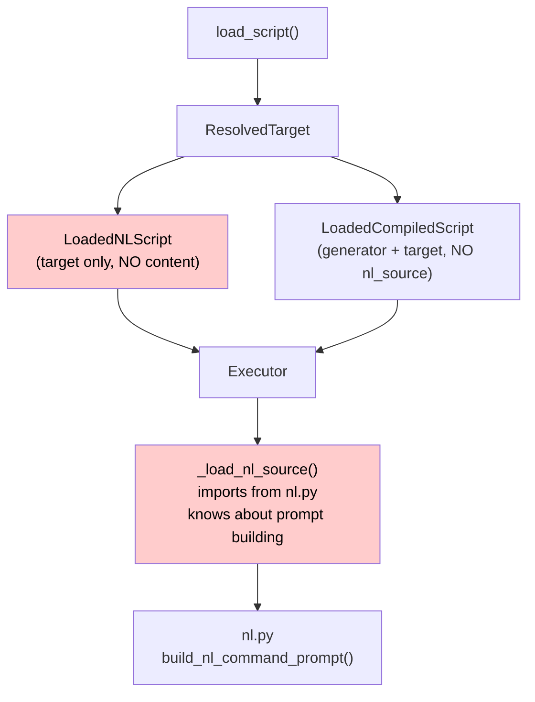
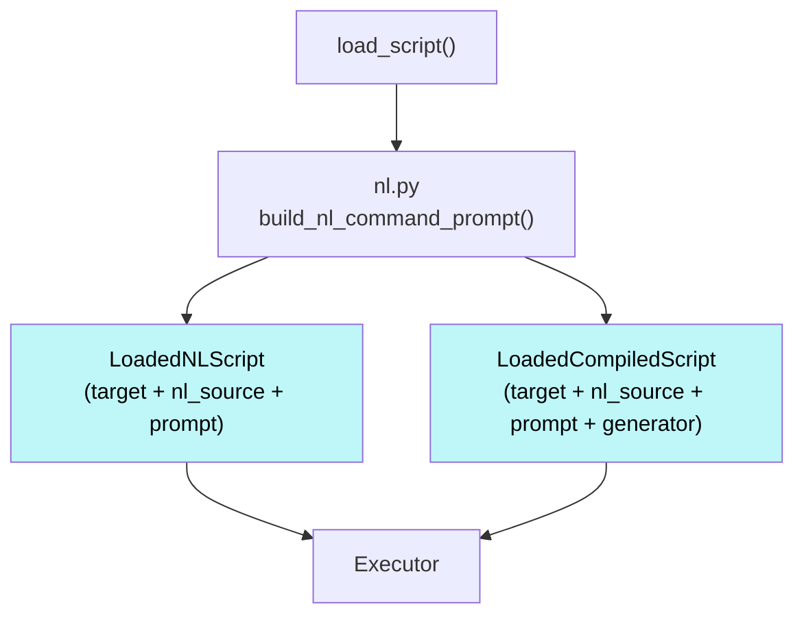

# Refactor: Scripting Module

## Introduction

Issue #5 asks us to refactor Python subpackages to have clean, minimal public APIs and clear separation of concerns. The scripting module is the first target.

The scripting module is well-structured in many ways, but has accumulated interface problems: loading types that don't actually contain loaded content, execution concerns leaking into the wrong layer, duplicated resolution logic, and dead code. These are exactly the kinds of issues that accumulate when a module lacks a precise spec — each change was locally reasonable but violated implicit boundaries that were never documented.

This refactor has two goals: (1) fix the concrete code issues, and (2) establish a module spec standard that prevents this class of problems from recurring.

## Objectives

1. Define a reusable **module spec standard** for documenting modules precisely enough to reconstruct them from spec alone
2. Write the scripting module spec in this format, describing the post-refactor state
3. Fix 8 concrete interface issues in the scripting module (loading, resolution, execution, runtime)
4. Remove dead code and unused fields

## Architecture

**Current module structure** (no changes to file organization):

```
src/mekara/scripting/
├── __init__.py       # Package exports
├── runtime.py        # Step types and result types
├── resolution.py     # Name → path resolution
├── loading.py        # Script loading entrypoint
├── auto.py           # Auto step execution
├── nl.py             # NL prompt construction
└── standards.py      # Standards resolution/loading
```

**Current data flow (showing the problems):**



**Target data flow:**



## Design Details

### Issue 1 & 2: LoadedScript types missing content

`LoadedNLScript` has only `target: ResolvedTarget` — no actual content. `LoadedCompiledScript` has `generator` + `target` but no NL source for context display and exception fallback. The executor must manually load and process NL content via `_load_nl_source()`.

**Fix:** Both loaded types share the same content fields. They are separate dataclasses (not a subclass relationship, so `isinstance()` type narrowing works correctly), but `LoadedCompiledScript` has all the same fields as `LoadedNLScript` plus `generator`:

```python
@dataclass
class LoadedNLScript:
    target: ResolvedTarget
    nl_source: str   # Raw NL file content (before processing)
    prompt: str      # Processed content ($ARGUMENTS substituted, standards injected)

@dataclass
class LoadedCompiledScript:
    target: ResolvedTarget
    nl_source: str   # Same fields as LoadedNLScript
    prompt: str
    generator: ScriptGenerator  # Additional field
```

`load_script()` calls `build_nl_command_prompt()` for both types. "Loaded" means ready to use — all content is present and processed.

### Issue 3: Executor knows about NL building

`_load_nl_source()` in `executor.py` imports `build_nl_command_prompt` from `nl.py` and knows about `$ARGUMENTS` substitution and standards injection. This violates separation of concerns — the executor's job is to _execute_, not to _build prompts_.

**Fix:** Remove `_load_nl_source()` entirely. Content comes pre-loaded from `LoadedScript` types. Frames store the content directly:

- `CompiledScriptFrame` gets `nl_source: str` and `prompt: str` (from `LoadedCompiledScript`)
- `NLScriptFrame` gets `nl_source: str` and `prompt: str` (from `LoadedNLScript`)
- `arguments: str` field removed from `ScriptFrame` (redundant — the arguments are already baked into `prompt` via `$ARGUMENTS` substitution, and `nl_source` is the raw content before substitution)

### Issue 4: Duplicate find functions

`_find_compiled_at()` and `_find_nl_at()` are identical except for file suffix (`.py` vs `.md`). Both check exact name first, then underscore variant.

**Fix:** Single `_find_script_at(base_path, name, name_underscored, suffix, *, is_bundled)` function.

### Issue 5: Over-specific `is_bundled_command` property

`is_bundled_command` combines two checks (`nl.is_bundled and compiled is None`). Not composable — callers can't independently check "is this NL-only?" or "is this compiled?".

**Fix:** Replace with composable `is_nl` and `is_compiled` properties. Usage site in CLI becomes `target.is_bundled and target.is_nl` — clearer intent, and each property is independently useful.

### Issue 6: Unused `list_all_commands` function

Defined but never called anywhere in the codebase. Dead code.

**Fix:** Delete entirely.

### Issue 7: Unused `ScriptCallResult.summary` field

Written in 4 places in `executor.py` but never read anywhere. The field is constructed with messages like `"Completed finish in 3 steps"` but no code ever accesses `result.summary`.

**Fix:** Remove `summary` field from `ScriptCallResult` and all constructor calls.

### Issue 8: Duplicated resolution precedence

`resolve_standard()` in `standards.py` reimplements the same 3-level precedence pattern (local > user > bundled) as `resolve_target()` in `resolution.py`. Both check local first, then user, then bundled, with the same directory structure assumptions.

**Fix:** Extract `_resolve_file_at_precedence_levels()` helper in `resolution.py` that takes a `max_level` parameter to cap the search. Both `resolve_target()` and `resolve_standard()` use it:

- `resolve_standard()` calls it with no cap (searches all three levels)
- `resolve_target()` calls it once for NL (no cap) to find the NL level, then again for compiled with `max_level` set to the NL level (enforcing "compiled must be at same-or-higher precedence than NL")

### Invariants

- NL source is always present in `ResolvedTarget`; compiled is optional
- `load_script()` returns fully-processed content — "loaded" means ready to use
- `LoadedCompiledScript` has the same fields as `LoadedNLScript` plus `generator` (separate dataclasses, not subclass — `isinstance()` type narrowing must work)
- Executor never imports from `nl.py` or `standards.py`
- Single precedence helper for both scripts and standards
- No unused public functions or fields
- Frame content is pre-loaded at push time, never lazy-loaded

## Implementation Plan

### Phase 1: Module Spec Standard

**Goal:** Define the reusable module spec format as a standard.

**File:** `docs/docs/standards/module-specs.md`

**Tasks:**

- [ ] Write the module spec standard with hierarchy: Purpose, Scope, Requirements, Architecture, Data Structures, Interfaces & Algorithms
- [ ] Document the precedence/constraint rule (lower sections must be consistent with higher ones)
- [ ] Document the rationale: friction points for scope creep, spec vs design doc distinction
- [ ] Update `docs/docs/standards/index.md` to include the new standard
- [ ] Add a short blurb to `docs/docs/standards/design-documents.md` noting that design docs describe transitions while module specs describe steady state

### Phase 2: Scripting Module Spec

**Goal:** Write the scripting module spec describing the post-refactor end state.

**File:** `docs/docs/code-base/mekara/capabilities/scripting.md`

**Note:** The module spec is the authoritative description of the end state. Human feedback during this phase may change specifics (field names, type structures, algorithm details) described in the Design Details above. When the spec and this design doc disagree, the spec wins — implementation phases follow the spec, not this document.

**Tasks:**

- [ ] Rewrite scripting.md in module spec format: Purpose, Scope, Requirements, Architecture, Data Structures, Interfaces & Algorithms
- [ ] Include all data structures with complete field-level detail
- [ ] Document edge cases (underscore fallback, exception fallback to NL, `$ARGUMENTS` first-occurrence-only substitution)
- [ ] Document scope boundaries (what the module does NOT do)

### Phase 3: Script Loading Interface (Issues 1, 2, 3)

**Goal:** Make loaded script types contain actual content and remove NL building from executor.

**Files:** `src/mekara/scripting/loading.py`, `src/mekara/mcp/executor.py`, `src/mekara/cli.py`, `tests/utils.py`

**Tasks:**

- [ ] Restructure `LoadedNLScript` with fields: `target`, `nl_source`, `prompt`
- [ ] Restructure `LoadedCompiledScript` with same fields as `LoadedNLScript` plus `generator` (separate dataclass, not subclass — `isinstance()` type narrowing must work)
- [ ] Update `load_script()` to call `build_nl_command_prompt()` and populate content fields
- [ ] Add `nl_source: str` and `prompt: str` to `CompiledScriptFrame` and `NLScriptFrame`
- [ ] Remove `arguments: str` from `ScriptFrame` (redundant — baked into `prompt` via `$ARGUMENTS` substitution)
- [ ] Update `_push_compiled_script()` and `_push_nl_script()` to accept and store content from loaded scripts
- [ ] Update `push_script()` and `run_until_llm()` call sites to pass content from loaded scripts
- [ ] Replace `self._load_nl_source(top_frame)` with frame content fields in `pending` property
- [ ] Remove `_load_nl_source()` method entirely (executor no longer imports from `nl.py`)
- [ ] Update CLI `_hook_user_prompt_submit()` to use `load_script()` instead of manual `build_nl_command_prompt()`
- [ ] Update `ScriptLoaderStub` / `LoadScriptStub` in `tests/utils.py` to populate content fields
- [ ] Run tests, type check

### Phase 4: Resolution Cleanup (Issues 4, 5, 6)

**Goal:** Consolidate duplicate functions, add composable properties, remove dead code.

**Files:** `src/mekara/scripting/resolution.py`, `src/mekara/cli.py`, `tests/test_resolution.py`

**Tasks:**

- [ ] Create `_find_script_at(base_path, name, name_underscored, suffix, *, is_bundled)` helper
- [ ] Replace `_find_compiled_at()` and `_find_nl_at()` calls with `_find_script_at()`
- [ ] Delete old `_find_compiled_at()` and `_find_nl_at()` functions
- [ ] Add `is_nl` property to `ResolvedTarget`: `return self.compiled is None`
- [ ] Add `is_compiled` property to `ResolvedTarget`: `return self.compiled is not None`
- [ ] Delete `is_bundled_command` property
- [ ] Update CLI usage from `target.is_bundled_command` to `target.is_bundled and target.is_nl`
- [ ] Update `test_is_bundled_command_property` test to test `is_nl`/`is_compiled` instead
- [ ] Delete `list_all_commands()` function (dead code — never called)
- [ ] Run tests, type check

### Phase 5: Runtime Cleanup (Issue 7)

**Goal:** Remove unused `summary` field.

**Files:** `src/mekara/scripting/runtime.py`, `src/mekara/mcp/executor.py`

**Tasks:**

- [ ] Remove `summary: str` from `ScriptCallResult` dataclass
- [ ] Remove `summary=...` from all 4 constructor calls in `executor.py` (the field was only written, never read)
- [ ] Update `scripting.md` call_script example (currently shows `result.summary` which will no longer exist)
- [ ] Run tests, type check

### Phase 6: Standards Resolution (Issue 8)

**Goal:** Extract shared precedence helper to eliminate duplicated resolution logic.

**Files:** `src/mekara/scripting/resolution.py`, `src/mekara/scripting/standards.py`

**Tasks:**

- [ ] Create `_resolve_file_at_precedence_levels()` in `resolution.py` with a `max_level` parameter to cap the search depth
- [ ] Refactor `resolve_standard()` to import and use the shared helper (no cap — searches all three levels)
- [ ] Refactor `resolve_target()` to use the shared helper: first call for NL (no cap), second call for compiled with `max_level` set to the NL result's level (enforcing same-or-higher precedence)
- [ ] Run tests, type check

## Notes

- This is an internal refactoring — no public API changes, no user-visible behavior changes
- VCR cassettes should not need re-recording (MCP tool outputs remain identical)
- Frame structure changes but execution semantics are preserved
- Resolution (`resolve_target()`) and loading (`load_script()`) remain separate functions: resolution is pure path logic (no I/O on file content), loading reads and processes content. Loading always follows resolution, but they are different concerns
- `refactor-plan.md` in the repo root is the historical context; this design doc and the module spec are the sources of truth going forward
