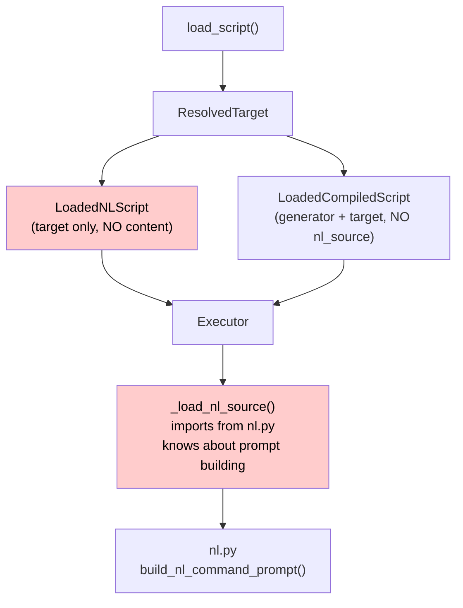
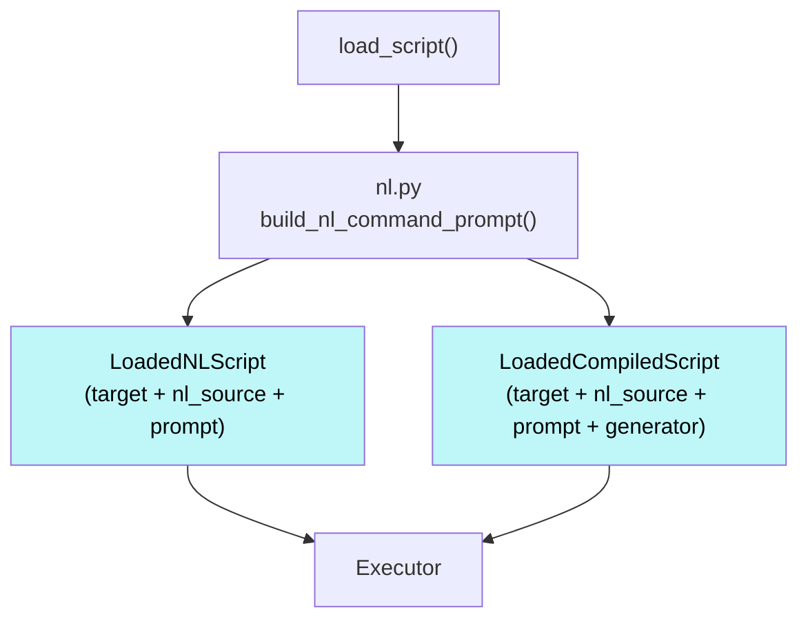

# Refactor: Scripting Module

## Introduction

Issue #5 asks us to refactor Python subpackages to have clean, minimal public APIs and clear separation of concerns. The scripting module is the first target.

The scripting module is well-structured in many ways, but has accumulated interface problems: loading types that don't actually contain loaded content, execution concerns leaking into the wrong layer, duplicated resolution logic, and dead code. These are exactly the kinds of issues that accumulate when a module lacks a precise spec — each change was locally reasonable but violated implicit boundaries that were never documented. For example, `_load_nl_source()` living in the executor wasn't a single bad decision; it was the result of incremental additions, each locally reasonable, that cumulatively violated the boundary between "execution" and "prompt building."

This refactor has two goals: (1) fix the concrete code issues, and (2) establish a module spec standard that prevents this class of problems from recurring.

### The Module Spec Standard

The module spec standard defines a format for documenting modules with enough precision that the module could be reconstructed from the spec alone — with only trivial differences (local variable names, formatting) between valid interpretations. Field names, types, field lists, and public signatures are all pinned. If a behavior isn't in the spec, it's not guaranteed.

The spec hierarchy is a **validation/constraint chain**, not just documentation ordering:

```
Purpose → Scope → Requirements → Architecture → Data Structures, Interfaces & Algorithms
```

Each level must be consistent with everything above it. If a lower section contradicts a higher one, the lower section is wrong and must be corrected. Purpose constrains scope. Scope constrains requirements. Requirements constrain architecture. Architecture constrains implementation details.

The **scope section** in particular creates legible friction for scope creep. When a spec says "this module does NOT handle X," any change that adds X-handling requires visibly modifying the spec — which requires human judgment. This forces a visible choice: expand scope (change the spec, get human approval) or create a new module. Without explicit scope boundaries, LLMs stuff new functionality wherever convenient, and nobody notices until you've accumulated a refactoring plan.

The spec format is generalizable to any module in any software project. Projects customize it as needed.

### Spec vs Design Document

These are complementary artifacts:

- A **design document** describes a _transition_ — what's changing, why, and how to get there. It has implementation phases, checkboxes, and is archived once the work is complete.
- A **module spec** describes _steady state_ — what the module is and exactly how it's structured. It's permanent and evolves with the module.

When refactoring: write the design doc first (transition plan), then write or update the module spec (target state). Implement against the spec, not the design doc.

## Objectives

1. Define a reusable **module spec standard** for documenting modules precisely enough to reconstruct them from spec alone — precise enough that two independent implementations satisfying the spec differ only in trivial ways
2. Write the scripting module spec in this format, describing the post-refactor state
3. Fix 8 concrete interface issues in the scripting module (loading, resolution, execution, runtime)
4. Remove dead code and unused fields

## Architecture

**Current module structure** (no changes to file organization):

```
src/mekara/scripting/
├── __init__.py       # Package exports
├── runtime.py        # Step types and result types
├── resolution.py     # Name → path resolution
├── loading.py        # Script loading entrypoint
├── auto.py           # Auto step execution
├── nl.py             # NL prompt construction
└── standards.py      # Standards resolution/loading
```

**Current data flow (showing the problems):**



**Target data flow:**



## Design Details

### Issue 1 & 2: LoadedScript types missing content

`LoadedNLScript` has only `target: ResolvedTarget` — no actual content. `LoadedCompiledScript` has `generator` + `target` but no NL source for context display and exception fallback. The executor must manually load and process NL content via `_load_nl_source()`.

**Fix:** Both loaded types carry the same content fields. They are **separate dataclasses** (not a subclass relationship) because `isinstance()` type narrowing must work — if `LoadedCompiledScript` subclassed `LoadedNLScript`, then `isinstance(loaded, LoadedNLScript)` would be `True` for both, breaking all the type narrowing used throughout `executor.py` and `cli.py`. `LoadedCompiledScript` duplicates the shared fields and adds `generator`:

```python
@dataclass
class LoadedNLScript:
    target: ResolvedTarget
    nl_source: str   # Raw NL file content (before processing)
    prompt: str      # Processed content ($ARGUMENTS substituted, standards injected)

@dataclass
class LoadedCompiledScript:
    target: ResolvedTarget
    nl_source: str   # Same fields as LoadedNLScript
    prompt: str
    generator: ScriptGenerator  # The only additional field
```

`load_script()` calls `build_nl_command_prompt()` for both types. "Loaded" means ready to use — all content is present and processed.

### Issue 3: Executor knows about NL building

`_load_nl_source()` in `executor.py` imports `build_nl_command_prompt` from `nl.py` and knows about `$ARGUMENTS` substitution and standards injection. This violates separation of concerns — the executor's job is to _execute_, not to _build prompts_.

**Fix:** Remove `_load_nl_source()` entirely. Content comes pre-loaded from `LoadedScript` types. Frames store the content directly:

- `CompiledScriptFrame` gets `nl_source: str` and `prompt: str` (from `LoadedCompiledScript`)
- `NLScriptFrame` gets `nl_source: str` and `prompt: str` (from `LoadedNLScript`)
- `arguments: str` field removed from `ScriptFrame` (redundant — the arguments are already baked into `prompt` at load time via `$ARGUMENTS` substitution; `nl_source` retains the raw content before substitution if the raw form is ever needed)

### Issue 4: Duplicate find functions

`_find_compiled_at()` and `_find_nl_at()` are identical except for file suffix (`.py` vs `.md`). Both check exact name first, then underscore variant.

**Fix:** Single `_find_script_at(base_path, name, name_underscored, suffix, *, is_bundled)` function.

### Issue 5: Over-specific `is_bundled_command` property

`is_bundled_command` combines two checks (`nl.is_bundled and compiled is None`). Not composable — callers can't independently ask "is this NL-only?" or "is this compiled?".

**Fix:** Replace with composable `is_nl` and `is_compiled` properties. Usage site in CLI becomes `target.is_bundled and target.is_nl` — clearer intent, and each property is independently useful.

### Issue 6: Unused `list_all_commands` function

Defined in `resolution.py` but never called anywhere in the codebase. Dead code.

**Fix:** Delete entirely.

### Issue 7: Unused `ScriptCallResult.summary` field

Written in 4 places in `executor.py` with messages like `"Completed finish in 3 steps"` but never read anywhere — no code ever accesses `result.summary`. The field exists only as a write target.

**Fix:** Remove `summary` field from `ScriptCallResult` and all 4 constructor calls in `executor.py`.

### Issue 8: Duplicated resolution precedence

`resolve_standard()` in `standards.py` reimplements the same 3-level precedence pattern (local > user > bundled) as `resolve_target()` in `resolution.py`. Both walk the same directory structure in the same order.

**Fix:** Extract `_resolve_file_at_precedence_levels()` helper in `resolution.py` with a `max_level` parameter to cap the search. This parameter is what allows both functions to share the same helper despite their different constraints:

- `resolve_standard()` calls it with no cap (searches all three levels, takes the highest-precedence match)
- `resolve_target()` calls it **twice**: first for NL (no cap) to find the NL level, then for compiled with `max_level` set to the NL result's level — enforcing "compiled must be at same-or-higher precedence than NL" as a parameter rather than special-case logic

### Invariants

- NL source is always present in `ResolvedTarget`; compiled is optional
- `load_script()` returns fully-processed content — "loaded" means ready to use
- `LoadedCompiledScript` has the same fields as `LoadedNLScript` plus `generator` — separate dataclasses, NOT a subclass, so `isinstance()` type narrowing works correctly throughout the codebase
- Executor never imports from `nl.py` or `standards.py`
- Single precedence helper for both scripts and standards; "compiled at same-or-higher precedence than NL" expressed as a `max_level` cap, not special-case logic
- No unused public functions or fields
- Frame content is pre-loaded at push time, never lazy-loaded

## Implementation Plan

### Phase 1: Module Spec Standard ✅

**Goal:** Define the reusable module spec format as a standard.

**File:** `docs/docs/standards/specs.md`

**Tasks:**

- [x] Write the spec standard with the hierarchy Purpose → Scope → Requirements → Architecture → Implementation, framed as a validation/constraint chain: each section must be consistent with all sections above it; conflicts are resolved upward. Standard is generic — "module" is shorthand for any (sub)system. Lives at `docs/docs/standards/specs.md`
- [x] Document the Scope section rationale: explicit NOT-responsibilities make scope creep highly visible and legible to humans, creating friction to discourage LLM agents from shoehorning unrelated changes onto existing modules when entirely new modules would make much more sense
- [x] Document that Requirements must capture edge cases explicitly (if a behavior isn't in the requirements, it's not guaranteed), and that the Implementation section must satisfy the "reconstruct from spec" test: two independent implementations differ only in local variable names, formatting, and other trivial choices
- [x] Document the spec vs design doc distinction as a `:::note` admonition: design docs describe transitions (temporary, become obsolete), specs describe steady state (living documents that stay current)
- [x] Update `docs/docs/standards/index.md` to include the new standard
- [x] Add `:::note[Design Docs vs. Specs]` admonition to `docs/docs/standards/design-documents.md` cross-referencing specs.md

### Phase 2: Scripting Module Spec

**Goal:** Write the scripting module spec describing the post-refactor end state.

**File:** `docs/docs/code-base/mekara/capabilities/scripting.md`

**Note:** The module spec is the authoritative description of the end state. It covers `src/mekara/scripting/` only — not `mcp/executor.py` or any other module, even though Phase 3 changes executor.py. Human feedback during this phase may change specifics (field names, type structures, algorithm details) described in the Design Details above. When the spec and this design doc disagree, the spec wins — implementation phases follow the spec, not this document.

**Tasks:**

- [ ] Rewrite scripting.md in module spec format per `docs/docs/standards/specs.md`: Purpose, Scope, Requirements, Architecture, Implementation (Data Structures + Interfaces + Algorithms)
- [ ] Scope section must include explicit NOT-responsibilities (e.g., "executor does not build prompts", "resolution does not read file content") — these are the boundaries that make violations visible
- [ ] Requirements section must document all edge cases including: underscore fallback (try exact name, then underscore variant at each precedence level), `$ARGUMENTS` first-occurrence-only substitution (subsequent occurrences preserved verbatim), exception fallback to NL when auto step fails
- [ ] Data Structures section must include every field of every major type with its name, type, and description — precise enough to reimplement without reading source code

### Phase 3: Script Loading Interface (Issues 1, 2, 3)

**Goal:** Make loaded script types contain actual content and remove NL building from executor.

**Files:** `src/mekara/scripting/loading.py`, `src/mekara/mcp/executor.py`, `src/mekara/cli.py`, `tests/utils.py`

**Tasks:**

- [ ] Restructure `LoadedNLScript` with fields: `target: ResolvedTarget`, `nl_source: str`, `prompt: str`
- [ ] Restructure `LoadedCompiledScript` as a separate dataclass (NOT a subclass of `LoadedNLScript` — subclassing breaks `isinstance()` type narrowing used throughout executor and CLI) with same fields plus `generator: ScriptGenerator`
- [ ] Update `load_script()` to call `build_nl_command_prompt()` for both types and populate content fields
- [ ] Add `nl_source: str` and `prompt: str` to `CompiledScriptFrame` and `NLScriptFrame`
- [ ] Remove `arguments: str` from `ScriptFrame` (redundant — arguments are already baked into `prompt` via `$ARGUMENTS` substitution at load time)
- [ ] Update `_push_compiled_script()` and `_push_nl_script()` to accept and store content from loaded scripts
- [ ] Update `push_script()` and `run_until_llm()` call sites to pass content from loaded scripts
- [ ] Replace `self._load_nl_source(top_frame)` calls in `pending` property with direct frame content field access
- [ ] Remove `_load_nl_source()` method entirely — executor must not import from `nl.py`
- [ ] Update CLI `_hook_user_prompt_submit()` to use `load_script()` instead of manually calling `build_nl_command_prompt()`
- [ ] Update `ScriptLoaderStub` / `LoadScriptStub` in `tests/utils.py` to populate `nl_source` and `prompt` fields
- [ ] Run tests, type check

### Phase 4: Resolution Cleanup (Issues 4, 5, 6)

**Goal:** Consolidate duplicate functions, add composable properties, remove dead code.

**Files:** `src/mekara/scripting/resolution.py`, `src/mekara/cli.py`, `tests/test_resolution.py`

**Tasks:**

- [ ] Create `_find_script_at(base_path, name, name_underscored, suffix, *, is_bundled)` helper to replace both `_find_compiled_at()` and `_find_nl_at()`, which are identical except for suffix
- [ ] Replace all `_find_compiled_at()` and `_find_nl_at()` calls with `_find_script_at()`
- [ ] Delete old `_find_compiled_at()` and `_find_nl_at()` functions
- [ ] Add `is_nl` property to `ResolvedTarget`: `return self.compiled is None`
- [ ] Add `is_compiled` property to `ResolvedTarget`: `return self.compiled is not None`
- [ ] Delete `is_bundled_command` property (replaced by `target.is_bundled and target.is_nl` at call sites — composable, clearer intent)
- [ ] Update CLI usage from `target.is_bundled_command` to `target.is_bundled and target.is_nl`
- [ ] Update `test_is_bundled_command_property` test to test `is_nl`/`is_compiled` instead
- [ ] Delete `list_all_commands()` function (dead code — never called anywhere in the codebase)
- [ ] Run tests, type check

### Phase 5: Runtime Cleanup (Issue 7)

**Goal:** Remove unused `summary` field.

**Files:** `src/mekara/scripting/runtime.py`, `src/mekara/mcp/executor.py`

**Tasks:**

- [ ] Remove `summary: str` from `ScriptCallResult` dataclass
- [ ] Remove `summary=...` from all 4 constructor calls in `executor.py` (the field was only ever written, never read — no code accesses `result.summary`)
- [ ] Update `scripting.md` call_script example (currently shows `result.summary` which will no longer exist)
- [ ] Run tests, type check

### Phase 6: Standards Resolution (Issue 8)

**Goal:** Extract shared precedence helper to eliminate duplicated resolution logic.

**Files:** `src/mekara/scripting/resolution.py`, `src/mekara/scripting/standards.py`

**Tasks:**

- [ ] Create `_resolve_file_at_precedence_levels(name, max_level)` in `resolution.py` — the `max_level` parameter is what makes the helper usable by both callers despite their different constraints
- [ ] Refactor `resolve_standard()` to use the shared helper with no cap (searches all three levels)
- [ ] Refactor `resolve_target()` to use the shared helper twice: first call for NL (no cap) to get the NL level, second call for compiled with `max_level` = NL level — this expresses "compiled must be at same-or-higher precedence than NL" as a parameter rather than special-case logic
- [ ] Run tests, type check

## Notes

- This is an internal refactoring — no public API changes, no user-visible behavior changes
- VCR cassettes should not need re-recording (MCP tool outputs remain identical)
- Frame structure changes but execution semantics are preserved
- Resolution (`resolve_target()`) and loading (`load_script()`) remain separate functions: resolution is pure path logic with no I/O on file content; loading reads and processes content. Loading always follows resolution, but they are different concerns — resolution finds files, loading reads them.
- `refactor-plan.md` in the repo root is the historical context; this design doc and the module spec are the sources of truth going forward
