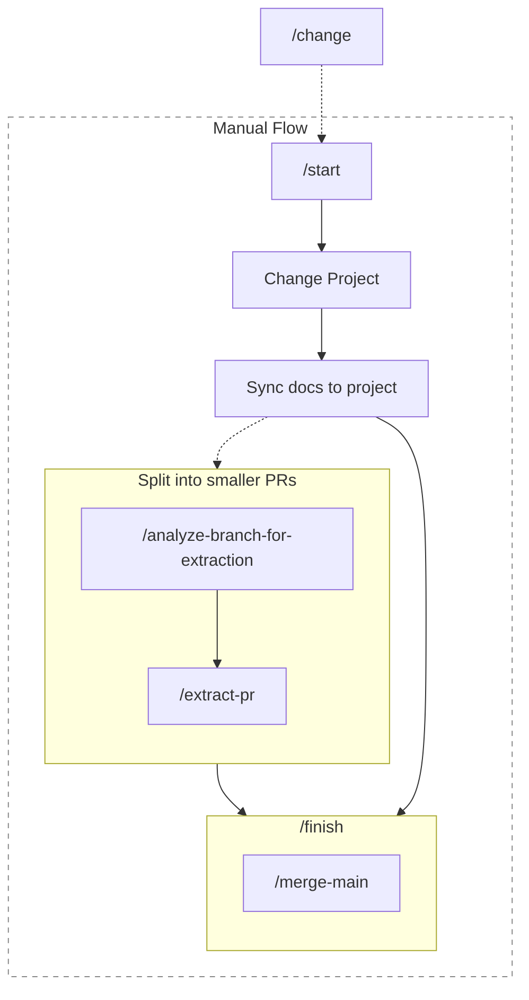
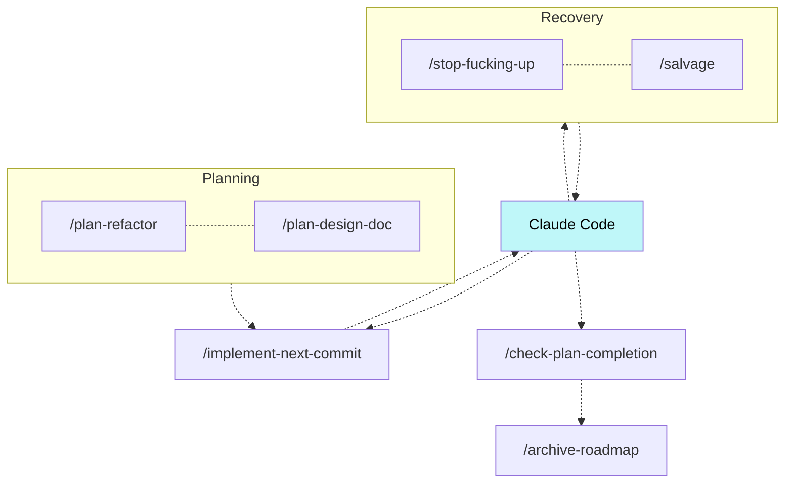
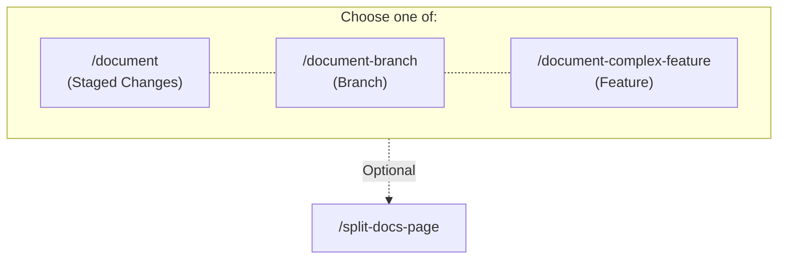
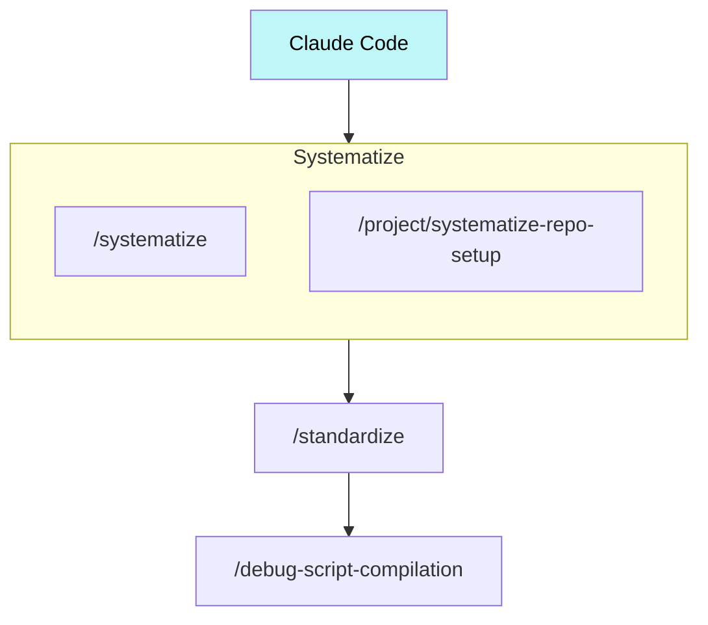
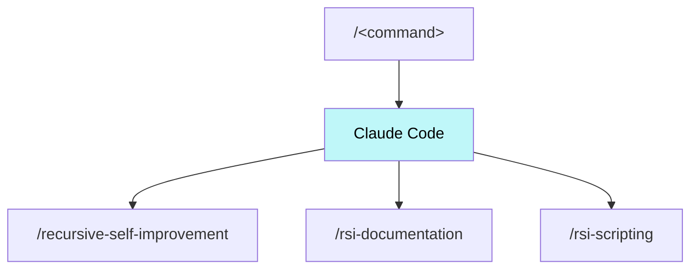

# Standard Mekara Workflow

This page documents the standard development workflow for all Mekara <Version /> projects. This workflow leverages Claude Code slash commands to create a complete development pipeline.

The workflow itself emerged from mekara's [core commands](../usage/index.md#core-commands)—`/systematize`, `/compile`, `/recursive-self-improvement`, and `/standardize`—applied iteratively to capture successful patterns, make them executable, and refine them based on experience. Every command documented here was created or improved using those same tools.

## Overview

mekara provides automation scripts that run inside Claude Code via MCP:

- [mekara install](../usage/commands/install.md) — Install mekara components (hooks, commands, or both)
- [Claude Code Integration](../code-base/mekara/capabilities/mcp.md) — Run mekara scripts inside Claude Code

**Workflow commands** are Claude Code slash commands invoked within a chat session (`/start`, `/finish`, etc.).

:::info

**Accessing Commands Without Installing Bundled Scripts**: If you've installed the mekara hooks but haven't installed the bundled commands to `~/.mekara/scripts/nl/` (symlinked as `~/.claude/commands/`, or vice versa), you can still access all mekara commands by using the double-slash syntax (`//command-name` instead of `/command-name`). The mekara hook will inject the bundled command content directly into the conversation. This allows you to try mekara workflows before committing to a full installation.

:::

## Get In

mekara works on any codebase. But it works especially well on a fresh one:

- Run `/project:new` to set up a complete project with repository initialization, code quality gates, documentation framework, GitHub CI, and deployment

Individual setup commands are available in the Wiki under Project How To's if you prefer a manual approach.

## Drive

The bread and butter of the mekara workflow is a standard pipeline through which new feature branches are opened and closed:

- `/change` provides a complete end-to-end workflow that combines all the steps below into a single command with explicit feedback loops. Use this when you want the agent to handle the entire process while ensuring you maintain control through iterative feedback before finalization.
- Alternatively, manage the workflow manually:
  - `/start` work on a new feature in a fresh Git worktree branch
    - Make your updates to the project. (See below for details)
    - Sync documentation to recent changes. (See below for details)
    - Optionally split this change up into smaller PRs:
      - `/analyze-branch-for-extraction` to optionally identify independently extractable changes (prerequisite refactorings, process improvements) that can be split into separate PRs
      - `/extract-pr` to extract specific subsets of changes into clean PRs for easier reviews
  - `/finish` to merge latest from main (via `/merge-main`), submit a PR, and merge once all checks pass

### Change Project

- Plan your changes via either:
  - `/plan-refactor` if no features are changing
  - `/plan-design-doc` if you are adding functionality
- `/implement-next-commit` to implement one commit at a time from a phased roadmap (follows the plan's Move/Add/Change sections)
- Then use Claude Code to interactively build your changes with AI
- If the agent keeps making repeated mistakes, run `/stop-fucking-up` to stop implementation and force it to fully understand the problem before continuing
- If the agent goes off track beyond recovery, run `/salvage` to hand work off to a fresh agent with lessons learned from the current session
- Run `/check-plan-completion` after implementing to verify all plan goals are met
- Run `/archive-roadmap` after completing a roadmap feature to move relevant information to permanent documentation and remove the completed roadmap file

:::info

All steps here are _optional_ except for Claude Code interaction. You don't need planning if your change is a simple one. You don't need to salvage anything if the AI implementation works on the first shot.

:::

### Docs Sync

To sync docs to the current state of the project, you can pick among the following options, all of which adhere to the [documentation guidelines](../code-base/documentation/conventions.md):

- `/document` to make a regular documentation update based on the changes made in the current session. **This should be your default.**
- `/document-branch` to document an entire branch by reviewing commits and filling any missing or incomplete documentation for its changes
- `/document-complex-feature` when documenting a technically complicated feature that required significant trial-and-error to implement, capturing all failed approaches and implementation details

If you find that a documentation page is getting too big and unwieldy, you can also pick:

- `/split-docs-page` to split a large page into a folder of smaller pages while preserving all information

## Mechanize

Sometimes after a long chat session, you realize that you want to repeat exactly what was done during this session. For example, maybe after a particularly gnarly interactive merge with the AI, you want to repeat the merge process you just went through. In such scenarios, you can make use of mekara's automated automation workflow:

- `/systematize` to generalize the dynamic session you just had with the AI into a new process
  - Optionally use `/project/systematize-repo-setup` instead when the process you're systematizing is "repo setup" and needs to stay stack-agnostic
- _Optionally_ `/standardize` to extract and centralize shared patterns across scripts so scripts stay consistent
- `/debug-script-compilation` during future command execution sessions that fix mistakes made in the compilation process

This process was in fact how `/merge-main` came to exist as another workflow.

## Accelerate

- `/recursive-self-improvement` may be run at any time to get the agent to improve its own workings based on the mistakes encountered and user guidance you gave it during your interactive session invoking a previous command. This command may even be run on itself, if mekara is not recursively improving itself correctly.
- `/rsi-documentation` may be run when you provide feedback about documentation organization or formatting during a session. It captures the latest guidance into [documentation conventions](../code-base/documentation/conventions.md) so future work follows the same patterns.
- `/rsi-scripting` may be run when you establish new conventions or patterns for natural language scripts during a session. It updates `/systematize` to teach future agents these conventions.

## Extras

Additional standalone commands that don't fit into the core workflow but are useful for specific scenarios:

- `/mobile-app` converts a React/Vite web app built with Google AI Studio to a native iOS/Android mobile app using Capacitor, wrapping your existing code with minimal changes

:::info

Any part of the Mekara workflow can be used in isolation. Although the default `mekara` workflows do form a cohesive whole, `mekara` does not force a particular development paradigm on you.

In fact, you are **_strongly encouraged_** to mold Mekara's default workflow scripts to what feels most natural for you.

:::
